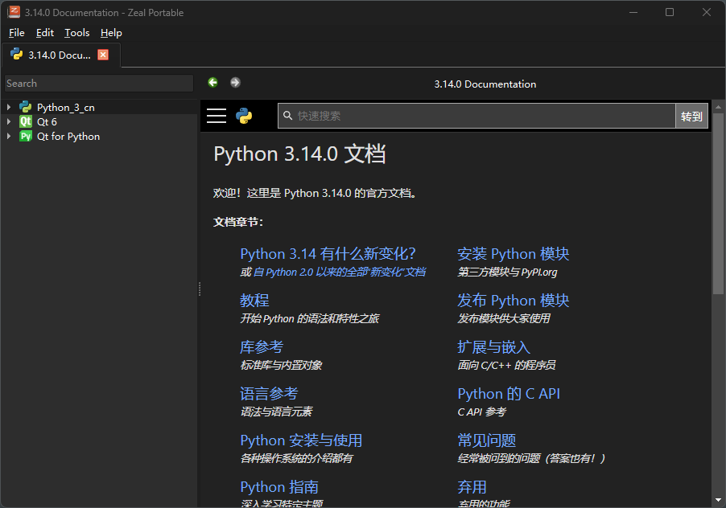

# Python3.12.4-docsets

This is a Python 3.12.4 ZH-CN Version docset for Dash and Zeal.

## Download from Releases

Unzip the `Python_3_cn.docset.7z` file to `~/Library/Application Support/Zeal/Zeal/Docsets` or `~/Library/Application Support/Dash/Docsets` for Mac or Linux, respectively.

## Build your own

1. Download the `HTML` Python 3.12.4 documentation from https://docs.python.org/zh-cn/3/download.html and extract it to `doc` folder.

2. Create `venv` and install `doc2dash`. 
    ```powershell
    python -m venv ./venv
    .\venv\Scripts\activate
    pip install doc2dash
    ```

    or

    ```powershell
    pdm install
    ```

3. Run 

    ```powershell
    .\build.bat
    ```

    or 

    ```powershell
    doc2dash -n Python_3_cn --icon .\assets\icon.png --icon-2x .\assets\icon@2x.png --force .\doc\
    ```

4. Copy the generated `Python_3_cn.docsets` folder to `~/Library/Application Support/Zeal/Zeal/Docsets` or `~/Library/Application Support/Dash/Docsets` for Mac or Linux, respectively.

5. Reopen Zeal or Dash. You should see the docsets.

    

6. If everything works fine, you can delete the English version of the docsets.